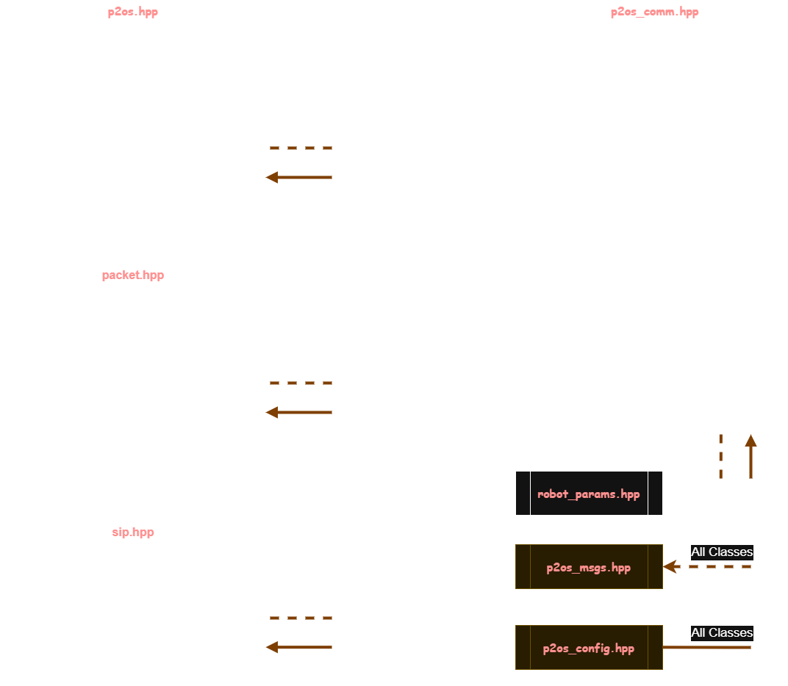

<h1 align="center">🔗 P2OS  Arduino</h1>
<p align="center">C++ implementation of the P2OS communication protocol for arduino</p>

## 🎈 Overview

P2OS (Pioneer 2 Operating System) Communication protocol for Arduino/ESP32 based in the [ROS P2OS package](https://github.com/allenh1/p2os). In addition to this ROS package, we used the [Pioner 2 manual](https://www.iri.upc.edu/groups/lrobots/private/Pioneer2/AT_DISK1/DOCUMENTS/p2opman9.pdf) as knowledge base.

If you want to undertand how this protocol works, check the file [p2os_overview.md](./p2os_overview.md)

## 🚀 Implementation example

Here I used the library to control the robot with my ps5 controller

https://github.com/user-attachments/assets/fecde3bc-d142-4da1-b995-2ee2f2d35c52

The video can also be viewed on youtube [here](https://www.youtube.com/watch?v=dj5ICpfwBbw)

## ⚡ Quick Start

If you are using platformio, add the library as dependece of your project:

```
[env:esp32doit-devkit-v1]
...
lib_deps = P2OS
```

check the example in the file [platformio.example.ini](./platformio.example.ini)

If you are using arduino ide, install the package from the packages available in the arduino library.

## 🧩 Project UML



- **p2os**: Class responsible for performing the entire P2OS communication. It includes methods for startup, shutdown, handling main loop operations, retrieving robot data, and sending velocity and motor state formatted for the robot.

- **p2os_comm**: Class responsible for encapsulating parameters, settings, and helper methods to perform the entire P2OS communication protocol correctly. This class is also responsible for managing the entire finite state machine required to connect with the robot.

- **packet**: Class responsible for building messages (adding headers and checksums), verifying received messages, receiving messages from the Pioneer 2DX, and sending messages to the Pioneer 2DX.

- **sip**: Class responsible for processing and managing data exchanged with a robot, such as separating the data into different types of variables and filtering out incorrect data.

- **robot_params**: File responsible for managing all Pioneer robot type configurations, like the distance between wheels, available commands, number of ultrasonic sensors etc.

- **p2os_config**: File responsible for maintaining all the P2OS protocol configurations.

- **p2os_msgs**: File responsible for defining all message types used throughout the P2OS protocol.

## 🎨 Format

The project uses `clang-format` to format files, there is a `.clang-format` with the formatting rules for the project. To install it, on Ubuntu, run the following command on the terminal:

```bash
sudo apt install clang-format
```

If you are using windows, check the official documentation [here](https://clang.llvm.org/get_started.html)