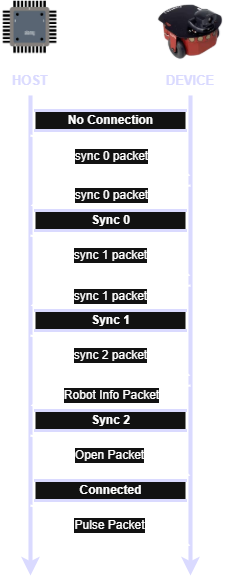
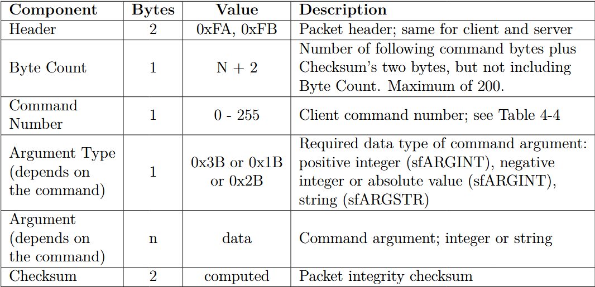

## 🤔 How does it work?

This protocol enables you to send commands to the actuators and receive data from the sensors. Additionally, it also allows you to modify the robot's configuration through the protocol.

### Robot Initialization

Initially, P2OS starts in an initial state **NOCONN**. To establish this connection, the client application must send three synchronization packets consecutively to the robot: the `SYNC0`, `SYNC1`, and `SYNC2` command packets. For each command, the device must receive the corresponding responses from the robot.

- After the `SYNC0` command, the robot transitions to the **SYNC0** state.  
- After `SYNC1`, it moves to the **SYNC1** state.  
- After `SYNC2`, it enters the **SYNC2** state.

The feedback from the robot before reaching the **SYNC2** state is a special packet containing information about the robot. This packet includes the name, type, and subtype of the currently connected robot.

After reaching the **SYNC2** state, it is possible to open the connection using the `Open` command packet. Once the `Open` command is sent, the robot transitions to the **CONNECTED** state.

Once the connection is established:
- The robot begins sending information about all available sensors.
- It receives data regarding the actuators.

To maintain the connection with the robot, a `pulse` command must be sent at least every **2 seconds**.

### P2OS Commands Packet

The P2OS protocol has a structured command format for receiving and responding to instructions from a device. It is possible to observe the whole command packet structure in the table.

Following that structure, if it is necessary to send a command "0" (which corresponds to the SYNC0 command), the complete packet will be "0xFA 0xFB 0x03 0x00 0x00 0x00". If it is necessary to send a command "1" (which corresponds to the SYNC1 command), the complete packet will be "0xFA 0xFB 0x03 0x01 0x00 0x01".
